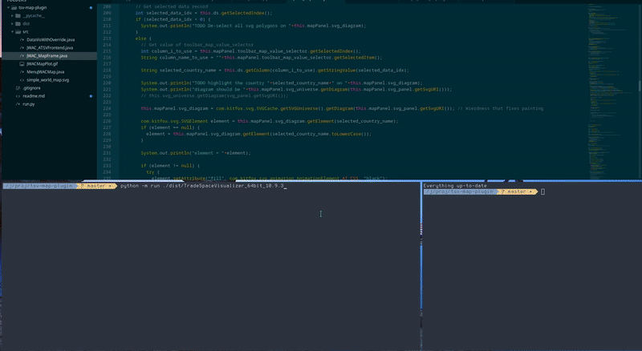

# JWAC TSV Map Plugin

This repository contains Java classes which extend the official TSV API classes
to provide a map plot type. The graphics are loaded by running the modified
main class `DataVisWithOverride` instead of the original TSV main class `DataVis` in `runATSV.bat`.

# Demo

# Building

Executing `python run.py PATH/TO/TradeSpaceVisualizer_64bit_10.9.3` will build our java source files
from `./src/` copy them into `./dist`, add `./dist` to the java `CLASSPATH`, and execute a java process running
the main class `DataVisWithOverride` (which replaces the `DataVis` main class originally shipped with TSV).

# Distributing

`run.py` also supports modifying an existing copy of TSV to include our map plugin classes.

Execute `python run.py PATH/TO/TradeSpaceVisualizer_64bit_10.9.3 dist` to add a `dist\jwac_atsv.jar` file and `runJWAC_ATSV.bat` script
to the `TradeSpaceVisualizer_64bit_10.9.3` directory. Once `runJWAC_ATSV.bat` is written it may be double-clicked on to run TSV exactly
how `runATSV.bat` would have run it, except we now have several new classes added to the program which manage our map data.

# Implementation Design/Overview

The actual map logic is in `JWAC_MapFrame.java`, split across 2 classes. The original design is similar to how other
graph windows were constructed, and because of this is a little cluttered.

`DataVisWithOverride.java` is responsible for constructing the window class in `JWAC_ATSVFrontend.java`, which extends
the TSV class `ATSVFrontend` to add the button from `MenuJWACMap.java`, which constructs `JWAC_MapFrame` to open the map graph.

